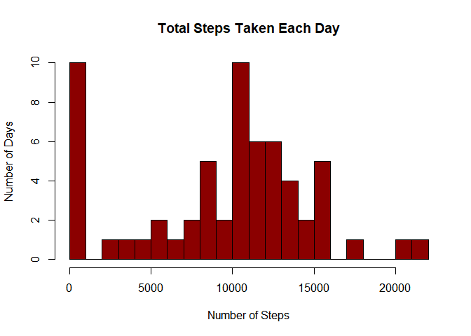
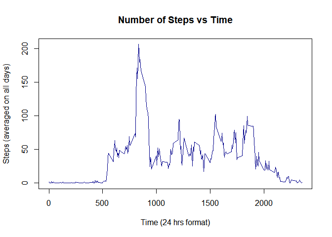
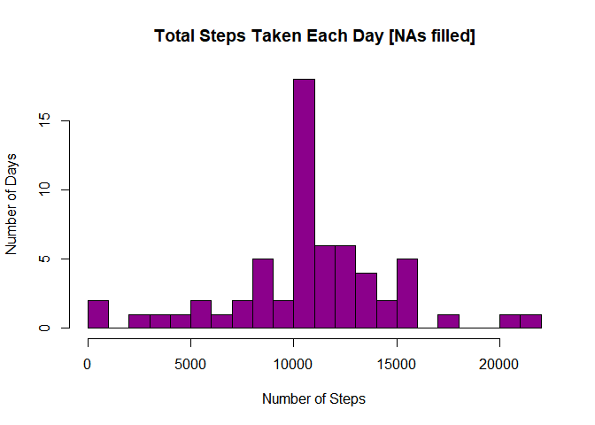
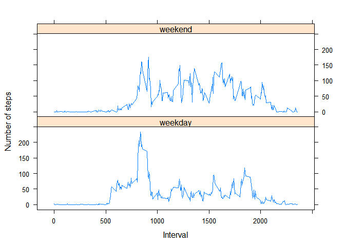

Reproducible Research - Course Project 1
========================================

### Loading and preprocessing the data

1.  Load the data (i.e. read.csv())

<!-- -->

    data <- read.csv(unz("activity.zip", "activity.csv"))

1.  Process/transform the data (if necessary) into a format suitable for
    your analysis

<!-- -->

    data$date <- strptime(data$date, format = "%Y-%m-%d")
    data$date <- as.factor(data$date)

### What is mean total number of steps taken per day?

For this part of the assignment, you can ignore the missing values in
the dataset.

1.  Calculate the total number of steps taken per day

<!-- -->

    d1 <- tapply(data$steps, data$date, sum, na.rm = TRUE)

1.  If you do not understand the difference between a histogram and a
    barplot, research the difference between them. Make a histogram of
    the total number of steps taken each day

<!-- -->

    hist(d1, main = "Total Steps Taken Each Day", xlab = "Number of Steps", ylab = "Number of Days", col = "darkred", breaks = 20)

1.  Calculate and report the mean and median of the total number of
    steps taken per day

<!-- -->

    mn <- mean(d1)
    md <- median(d1)

Mean = 9354.2295082 Median = 10395

### What is the average daily activity pattern?

1.  Make a time series plot (i.e. type = “l”) of the 5-minute interval
    (x-axis) and the average number of steps taken, averaged across all
    days (y-axis)

<!-- -->

    d1 <- tapply(data$steps, data$interval, mean, na.rm =TRUE)
    plot(names(d1), d1, type = "l", col = "darkblue", xlab = "Time (24 hrs format)", ylab = "Steps (averaged on all days)", main = "Number of Steps vs Time")

2.Which 5-minute interval, on average across all the days in the
dataset, contains the maximum number of steps?

    int <- names(d1)[d1 == max(d1)]

5-minute interval for maximum number of steps = 835

### Imputing missing values

Note that there are a number of days/intervals where there are missing
values (coded as NA). The presence of missing days may introduce bias
into some calculations or summaries of the data.

1.  Calculate and report the total number of missing values in the
    dataset (i.e. the total number of rows with NAs)

<!-- -->

    nas = as.numeric(summary(complete.cases(data))["FALSE"])

Total number of rows with NAs = 2304

1.  Devise a strategy for filling in all of the missing values in the
    dataset. The strategy does not need to be sophisticated. For
    example, you could use the mean/median for that day, or the mean for
    that 5-minute interval, etc.

<!-- -->

    d1 <- tapply(data$steps, data$interval, mean, na.rm =TRUE)

Filling the NAs with mean values of interval

1.  Create a new dataset that is equal to the original dataset but with
    the missing data filled in.

<!-- -->

    data2 <- data
    data2[is.na(data2)] <- d1[as.character(data2$interval[is.na(data2)])]

1.  Make a histogram of the total number of steps taken each day and
    Calculate and report the mean and median total number of steps taken
    per day. Do these values differ from the estimates from the first
    part of the assignment? What is the impact of imputing missing data
    on the estimates of the total daily number of steps?

<!-- -->

    d2 <- tapply(data2$steps, data2$date, sum)
    hist(d2, main = "Total Steps Taken Each Day [NAs filled]", xlab = "Number of Steps", ylab = "Number of Days", col = "darkmagenta", breaks = 20)

    mn2 <- mean(d2)
    md2 <- median(d2)

New mean is 1.076618910^{4}. Older is 9354.2295082. New median is
1.076618910^{4}. Older is 10395. It can be seen that the mean and median
has shown a positive change after the NAs were filled with mean values
of interval.

### Are there differences in activity patterns between weekdays and weekends?

For this part the weekdays() function may be of some help here. Use the
dataset with the filled-in missing values for this part.

1.  Create a new factor variable in the dataset with two levels –
    “weekday” and “weekend” indicating whether a given date is a weekday
    or weekend day.

<!-- -->

    data$date <- as.Date(data$date, format = "%Y-%m-%d")
    data$weekend <- weekdays(data$date, abbreviate = TRUE) %in% c("Sat", "Sun")

1.  Make a panel plot containing a time series plot (i.e. type = “l”) of
    the 5-minute interval (x-axis) and the average number of steps
    taken, averaged across all weekday days or weekend days (y-axis).
    See the README file in the GitHub repository to see an example of
    what this plot should look like using simulated data.

<!-- -->

    library(lattice)
    data <- aggregate(data$steps, data[,c(3,4)], mean, na.rm = TRUE)
    xyplot(x ~ interval | weekend, data = data, layout = c(1,2), type = "l", xlab = "Interval", ylab = "Number of steps", strip = strip.custom(factor.levels = c("weekday", "weekend")))

